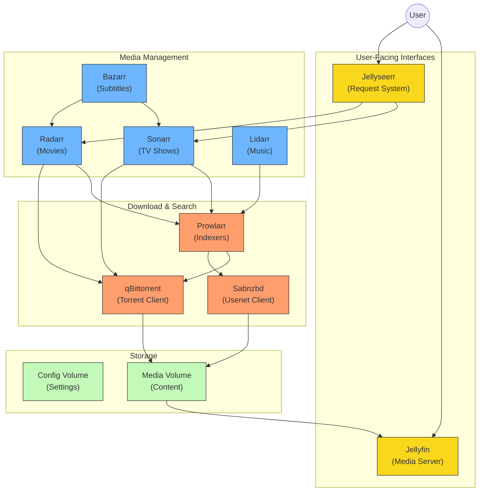

# TorrentBox Kubernetes Stack: Media Management Suite

This comprehensive guide details how to deploy a suite of media management applications on a Kubernetes cluster. The stack provides an integrated ecosystem for discovering, downloading, organizing, and streaming your media library.

## What is TorrentBox?

TorrentBox is a collection of specialized applications working together to automate your media management:

- **Content Management**: Sonarr (TV shows), Radarr (movies), and Lidarr (music) automatically search for, download, and organize media
- **Subtitle Management**: Bazarr automatically finds and downloads subtitles
- **Download Management**: qBittorrent (torrents) and Sabnzbd (Usenet) handle the actual downloading
- **Indexer Management**: Prowlarr centralizes your indexer configuration
- **Media Serving**: Jellyfin streams your media library to any device
- **Request Management**: Jellyseerr provides a user-friendly interface for requesting new content

## ⚠️ Security Notice

**IMPORTANT**: This deployment currently runs without VPN protection. The Gluetun VPN sidecar was removed due to connectivity issues. This means:

- All network traffic is **NOT** encrypted through a VPN
- Your IP address is **directly exposed** to external services
- This setup is **NOT recommended** for public networks or where privacy is a concern

Consider implementing alternative VPN solutions before deploying in a production environment.

## Architecture Overview

The system is organized into several interconnected components:



### Key Components Explained

1. **Storage**:
    
    - **Application Configuration**: Each application stores its settings in a dedicated subdirectory inside `./config`on the host machine via `hostPath` volumes
    - **Media and Downloads**: All applications access a shared persistent volume (`main-data-pvc`) for media files and downloads
2. **Network Communication**:
    
    - Applications communicate with each other using Kubernetes Services
    - Internal services use ClusterIP type (internal network only)
    - User-facing applications (Jellyfin, Jellyseerr, Sabnzbd) use NodePort type for external access
3. **Application Workflow**:
    
    - **Content Discovery**: Prowlarr manages indexers and feeds them to *arr applications
    - **Content Management**: Sonarr/Radarr/Lidarr request downloads from qBittorrent/Sabnzbd
    - **Post-Processing**: Downloaded files are organized into the media library
    - **Subtitles**: Bazarr fetches subtitles for content in the library
    - **Media Access**: Jellyfin provides streaming access to the organized library
    - **Request System**: Jellyseerr lets users browse and request new content

## Prerequisites in Detail

Before deploying, ensure you have:

1. **Kubernetes Cluster**: A functioning Kubernetes cluster (single-node is fine for home use)
    
2. **kubectl Configured**: Your local machine must have `kubectl` installed and configured to connect to your cluster
    
    ```bash
    # Verify connection to your cluster
    kubectl cluster-info
    ```
    
3. **Storage Preparation**:
    
    - Create a `./config` directory on your Kubernetes node where the pods will run
    - Create subdirectories for each application (they will be created automatically if you have sufficient permissions)
    
    ```bash
    mkdir -p ./config/{qbittorrent,sonarr,radarr,lidarr,bazarr,prowlarr,jellyfin,jellyseerr,sabnzbd}
    ```
    
4. **Permissions**: Set correct ownership and permissions on the config directories
    
    ```bash
    # Using default PUID=1000, PGID=1000 (adjust as needed)
    chown -R 1000:1000 ./config
    chmod -R 755 ./config
    ```
    
5. **Secrets Preparation**: Create the required secrets file (example template below)
    

## Step-by-Step Deployment Guide

### 1. Create Namespace

First, create a dedicated namespace for the TorrentBox stack:

```bash
kubectl apply -f 00-namespace.yaml
```

### 2. Create Secret

Create a `02-secret.yaml` file with your sensitive information:

```yaml
apiVersion: v1
kind: Secret
metadata:
  name: torrentbox-secrets
  namespace: torrentbox
type: Opaque
stringData:
  # Replace these with actual values
  PROWLARR_API_KEY: "your-prowlarr-api-key"
  SONARR_API_KEY: "your-sonarr-api-key"
  RADARR_API_KEY: "your-radarr-api-key"
  LIDARR_API_KEY: "your-lidarr-api-key"
  JELLYSEERR_API_KEY: "your-jellyseerr-api-key"
  # Add other secrets as needed
```

Apply the secrets file:

```bash
kubectl apply -f 02-secret.yaml
```

### 3. Deploy ConfigMap and PVC

Deploy the ConfigMap (containing environment variables) and PersistentVolumeClaim:

```bash
kubectl apply -f 01-configmap.yaml
kubectl apply -f 03-main-data-pvc.yaml
```

### 4. Deploy Applications

Deploy all applications in order:

```bash
# Deploy service and deployment files for each application
kubectl apply -f 10-qbittorrent-service.yaml -f 11-qbittorrent-deployment.yaml
kubectl apply -f 12-flaresolverr-service.yaml -f 13-flaresolverr-deployment.yaml
kubectl apply -f 14-prowlarr-service.yaml -f 15-prowlarr-deployment.yaml
# Continue with the rest of the applications...
```

For convenience, you can deploy everything at once (excluding secrets if managed separately):

```bash
kubectl apply -f . --exclude 00-namespace.yaml --exclude 02-secret.yaml
```

### 5. Verify Deployment

Monitor the deployment progress:

```bash
# Watch pods starting up
kubectl get pods -n torrentbox -w

# Check services
kubectl get services -n torrentbox

# Check PVC
kubectl get pvc -n torrentbox
```

Wait until all pods show `READY 1/1` and `STATUS Running`. This may take a few minutes depending on your hardware and network.

## Accessing Your Applications

### Direct Access (NodePort)

The following applications are accessible directly via NodePort:

1. **Jellyfin** (media server)
2. **Jellyseerr** (content requests)
3. **Sabnzbd** (Usenet downloader)

To find the assigned NodePorts:

```bash
kubectl get services -n torrentbox | grep NodePort
```

You'll see output like:

```
jellyfin    NodePort    10.43.xx.xx   <none>        8096:32744/TCP   24h
```

This means Jellyfin is accessible at `http://<your-node-ip>:32744`

### Port Forwarding (Development/Internal Access)

For services with ClusterIP, use port forwarding to access them temporarily:

```bash
# Access Sonarr on http://localhost:8989
kubectl port-forward service/sonarr -n torrentbox 8989:8989
```

Available services for port forwarding:

- qBittorrent: Port 8080
- Sonarr: Port 8989
- Radarr: Port 7878
- Lidarr: Port 8686
- Bazarr: Port 6767
- Prowlarr: Port 9696
- Flaresolverr: Port 8191

## Application Configuration Guide

After deploying, you'll need to configure each application. Here's how they connect:

### qBittorrent Setup

1. Access qBittorrent UI via port forwarding
2. Default login: username `admin`, password `adminadmin`
3. Change the default password
4. Configure download paths to use:
    - Download path: `/data/torrents/incomplete`
    - Completed downloads: `/data/torrents/complete`

### Sonarr/Radarr/Lidarr Configuration

1. Access each application UI via port forwarding
2. Add qBittorrent as a download client:
    - Host: `qbittorrent.torrentbox.svc.cluster.local`
    - Port: `8080`
    - Username/Password: as set in qBittorrent
3. Configure root folders:
    - Sonarr: `/data/media/tv`
    - Radarr: `/data/media/movies`
    - Lidarr: `/data/media/music`

### Prowlarr Configuration

1. Access Prowlarr UI via port forwarding
2. Add indexers (torrent sites, Usenet providers)
3. Add applications to connect to:
    - Sonarr URL: `http://sonarr.torrentbox.svc.cluster.local:8989`
    - Radarr URL: `http://radarr.torrentbox.svc.cluster.local:7878`
    - Lidarr URL: `http://lidarr.torrentbox.svc.cluster.local:8686`
    - API Keys: Use the keys from your secret file

### Jellyfin Setup

1. Access Jellyfin UI via NodePort
2. Complete the initial setup wizard
3. Add media libraries:
    - TV Shows: `/data/media/tv`
    - Movies: `/data/media/movies`
    - Music: `/data/media/music`

### Jellyseerr Configuration

1. Access Jellyseerr UI via NodePort
2. Connect to Jellyfin:
    - Jellyfin URL: `http://jellyfin.torrentbox.svc.cluster.local:8096`
3. Connect to Sonarr/Radarr:
    - Sonarr URL: `http://sonarr.torrentbox.svc.cluster.local:8989`
    - Radarr URL: `http://radarr.torrentbox.svc.cluster.local:7878`
    - API Keys: Use the keys from your secret file

## Maintenance Operations

### Updating Container Images

To update an application to a newer version:

1. Edit the deployment file for the application
2. Update the image tag to the desired version
    
    ```yaml
    # Beforeimage: lscr.io/linuxserver/sonarr:latest# After (using specific version)image: lscr.io/linuxserver/sonarr:4.0.1
    ```
    
3. Apply the updated deployment
    
    ```bash
    kubectl apply -f 16-sonarr-deployment.yaml
    ```
    

### Stopping the Stack

To remove the entire stack while preserving configuration:

```bash
kubectl delete -f . --exclude 00-namespace.yaml --exclude 02-secret.yaml
```

To completely remove everything including namespace:

```bash
kubectl delete -f .
```

## Troubleshooting Common Issues

### Pods Stuck in Pending State

**Possible cause**: Insufficient resources or PVC issues

**Solution**: Check PVC status and node resources

```bash
kubectl describe pvc main-data-pvc -n torrentbox
kubectl describe node <your-node-name>
```

### Permission Issues

**Possible cause**: Incorrect PUID/PGID or folder permissions

**Solution**: Verify permissions on host directories

```bash
# Check PUID/PGID in configmap
kubectl get configmap torrentbox-config -n torrentbox -o yaml | grep -E 'PUID|PGID'

# Adjust permissions on host
sudo chown -R <PUID>:<PGID> ./config
```

### Inter-Service Communication Issues

**Possible cause**: Incorrect service URLs

**Solution**: Verify service discovery is working

```bash
# Deploy a temporary debug pod
kubectl run -it --rm debug --image=curlimages/curl -n torrentbox -- sh

# Test connectivity to a service
curl http://sonarr.torrentbox.svc.cluster.local:8989/api/v3/system/status
```

## Additional Resources

For more details on individual applications:

- [Sonarr Documentation](https://wiki.servarr.com/sonarr)
- [Radarr Documentation](https://wiki.servarr.com/radarr)
- [Lidarr Documentation](https://wiki.servarr.com/lidarr)
- [Prowlarr Documentation](https://wiki.servarr.com/prowlarr)
- [Jellyfin Documentation](https://jellyfin.org/docs/)
- [qBittorrent Documentation](https://github.com/qbittorrent/qBittorrent/wiki)

For Kubernetes guidance:

- [Kubernetes Documentation](https://kubernetes.io/docs/home/)
- [kubectl Reference](https://kubernetes.io/docs/reference/kubectl/)

## Conclusion

This TorrentBox Kubernetes stack provides a robust media management system that automates discovering, downloading, organizing, and streaming your media library. By following this guide, you can deploy and configure all necessary components to work together seamlessly.

Remember to regularly backup your configuration directories and consider implementing additional security measures like a VPN for your production deployment.
